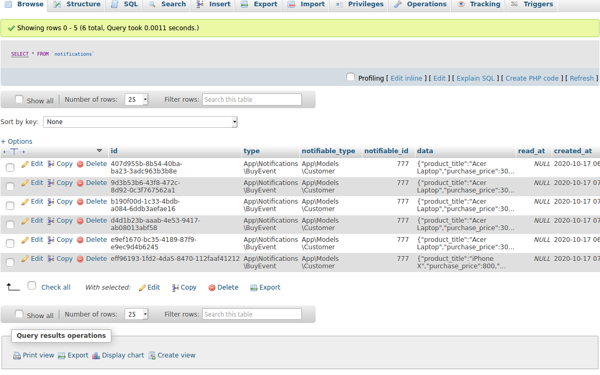
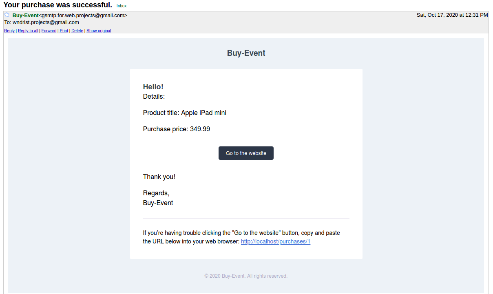
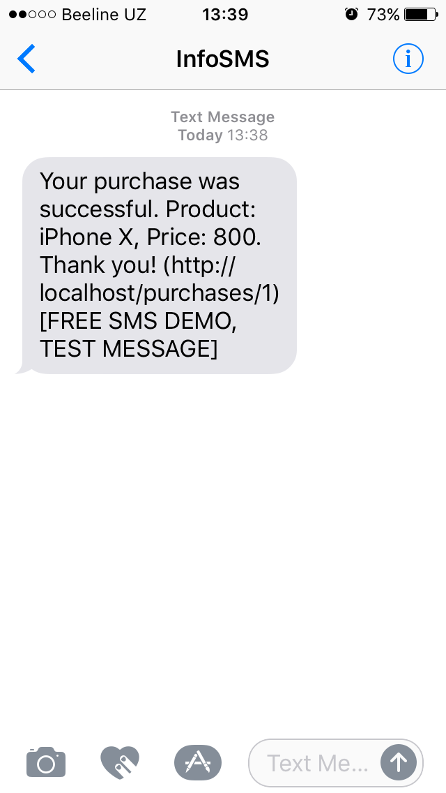

# Getting started

## Installation

Please check the official laravel installation guide for server requirements before you start. [Official Documentation](https://laravel.com/docs/7.x/installation#installation)

Clone the repository

    git clone git@github.com:syncedprojects/buy-event.git

Switch to the repo folder

    cd buy-event

Install all the dependencies using composer

    composer install

Generate a new application key

    php artisan key:generate

Run the database migrations (**Set the database connection in .env before migrating**)

    php artisan migrate

**TL;DR command list**

    git clone git@github.com:syncedprojects/buy-event.git
    cd buy-event
    composer install
    php artisan key:generate
    
**Make sure you set the correct database connection information before running the migrations** [Environment variables](#environment-variables)

    php artisan migrate

## Environment variables

- `.env` - Environment variables can be set in this file

## Notifications

Console Help

    php artisan help purchase-notification:send
    
Description:
    
    Sends purchase notifications to customers on various channels (database, mail, sms).

Usage:
  
    purchase-notification:send [options] [--] <channel>

Arguments:
  
    channel                      database, mail, sms

Options:
    
    --customer_id[=CUSTOMER_ID]  The ID of customer (for testing default customer is returned if not found instead of error)
    --phone[=PHONE]              The phone of customer (for testing a customer is generated based on this value)
    --email[=EMAIL]              The email of customer (for testing a customer is generated based on this value)
    --purchase_id[=PURCHASE_ID]  The ID of the purchase (purchase gets generated randomly)

### Sample Usage

#### Database notifications

    php artisan purchase-notification:send database --customer_id=777 --purchase_id=1
    
    php artisan purchase-notification:send database --email=synced.projects@gmail.com --purchase_id=33
    
    php artisan purchase-notification:send database --email=synced.projects@gmail.com --phone=9989097xxxx6 --purchase_id=89

#### Mail notifications

    php artisan purchase-notification:send mail --customer_id=21 --purchase_id=245
    
    php artisan purchase-notification:send mail --email=synced.projects@gmail.com --purchase_id=74

#### SMS notifications

    php artisan purchase-notification:send sms --customer_id=93 --purchase_id=17
    
    php artisan purchase-notification:send sms --phone=9989097xxxx6 --purchase_id=56

## Screenshots

#### Database

#### Mail

#### SMS (Nexmo)

